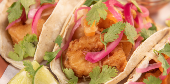

# 📚 Personal Design Patterns Knowledge Base - CookingMasters

> *My reference guide for multi-page design patterns implementations in JavaScript*

## 🎯 Purpose

This repository serves as my personal knowledge base for understanding and implementing multi-page design patterns in JavaScript. It uses a recipe application as the foundation to demonstrate various architectural patterns for multi-page applications in real, working code.

---

## 📊 Architecture Overview

### **Multi-Page Application Patterns**
This application demonstrates key patterns for building efficient multi-page web applications:

- **Page View Transitions**: Smooth transitions between different recipe pages
- **Prefetching**: Loading content before user navigation
- **Prerendering**: Optimizing page load performance
- **Resource Management**: Efficient handling of images and content across pages

---

## 🏗️ Current Implementation Focus

### **Multi-Page Architecture Pattern** 📄
**Purpose:** Traditional multi-page structure optimized for SEO and accessibility

**Location:** Multiple HTML files (`index.html`, `asado.html`, `calamari.html`, etc.)

**Implementation Details:**
- Separate HTML pages for each recipe
- Shared CSS and resource files
- Progressive Web App capabilities via manifest
- Optimized for search engine crawling

**Key Benefits:**
- SEO-friendly URL structure
- Fast initial page loads
- Browser back/forward button support
- Better accessibility for screen readers

### **View Transition Navigation Pattern** 🎬
**Purpose:** Smooth, animated transitions between recipe pages while maintaining multi-page architecture benefits

**Location:** Implemented via `view-transition-name` attributes across HTML files

**Implementation Details:**
```html
<!-- index.html - Recipe listings with transition names -->
<a href="fish-tacos.html" class="large recipe">
  
  <h4>Fish Tacos with Pickled Onion</h4>
</a>

<!-- fish-tacos.html - Corresponding image with matching transition name -->

```

**Pattern Architecture:**
- **Shared Element Transitions**: Images with matching `view-transition-name` attributes
- **Prerendering Enhancement**: Speculation Rules API for instant page loads
- **Progressive Enhancement**: Works without JavaScript, enhanced with modern APIs
- **Cross-Page Continuity**: Visual elements appear to "morph" between pages

**Implementation Map:**
```
index.html:
├── view-transition-name: fish-tacos      → fish-tacos.html
├── view-transition-name: vegetarian-pho  → vegetarian-pho.html  
├── view-transition-name: asado           → asado.html
├── view-transition-name: southwest-nachos → southwest-nachos.html
├── view-transition-name: calamari        → calamari.html
└── view-transition-name: ddl-brownies    → ddl-brownies.html
```

**Browser Support & Fallbacks:**
- **Modern Browsers (Chrome 111+)**: Automatic smooth transitions via View Transitions API
- **Older Browsers**: Standard navigation with instant page loads via prerendering
- **Progressive Enhancement**: Core functionality works everywhere, enhanced experience in supported browsers

**Key Benefits:**
- **App-like Experience**: Smooth transitions make multi-page feel like SPA
- **Maintained SEO**: Full benefits of multi-page architecture preserved
- **Performance**: Prerendering provides near-instant navigation
- **Accessibility**: Respects user motion preferences automatically
- **Zero JavaScript Required**: Works purely with HTML and CSS

**Advanced Features:**
```html
<!-- Speculation Rules API for instant navigation -->
<script type="speculationrules">
{
  "prerender": [
    {"urls": [
      "asado.html",
      "calamari.html", 
      "ddl-brownies.html",
      "fish-tacos.html",
      "southwest-nachos.html",
      "vegetarian-pho.html"
    ]}
  ]
}
</script>
```

---

## 🔍 Pattern Analysis

### **Design Decisions Made:**

1. **Multi-Page Architecture**: Chosen for SEO benefits and traditional web navigation patterns
2. **View Transition Navigation**: Implemented to provide app-like experience without sacrificing multi-page benefits
3. **Shared Element Transitions**: Images use matching `view-transition-name` attributes for smooth morphing between pages
4. **Prerendering Strategy**: Speculation Rules API preloads all recipe pages for instant navigation
5. **Progressive Enhancement**: Core functionality works everywhere, enhanced in modern browsers
6. **Shared Resources**: CSS and images shared across pages for efficiency
7. **PWA Capabilities**: Web manifest for app-like experience

### **Why These Patterns Work Together:**
- Multi-page structure provides SEO benefits while view transitions add modern UX
- Prerendering eliminates loading delays, making transitions feel instant
- Shared element transitions create visual continuity between recipe browsing and viewing
- Progressive enhancement ensures the app works on all devices and browsers
- Shared resources reduce bandwidth usage across page visits
- PWA features enhance user experience without compromising traditional web benefits
- Static approach ensures fast loading and broad compatibility

## 🧠 Learning Notes

### **Multi-Page Pattern Insights:**
- Traditional navigation with modern performance optimizations
- Balance between SEO benefits and user experience
- Strategic resource loading for optimal performance
- Progressive enhancement approach

### **View Transition Pattern Insights:**
- **Zero JavaScript Required**: Pure HTML/CSS implementation using modern web standards
- **Automatic Browser Optimization**: View Transitions API handles animation performance
- **Shared Element Continuity**: Matching `view-transition-name` creates seamless morphing effects
- **Fallback Strategy**: Graceful degradation ensures universal compatibility
- **Performance First**: Prerendering makes transitions feel instantaneous

### **Implementation Considerations:**
- **Naming Convention**: Use descriptive, consistent names for view transitions (e.g., `fish-tacos`, `vegetarian-pho`)
- **Cross-Page Coordination**: Ensure matching transition names between source and destination pages
- **Progressive Loading**: Speculation Rules API preloads content for smooth experiences
- **Accessibility**: Browser respects `prefers-reduced-motion` automatically
- **SEO Preservation**: Full multi-page benefits maintained (crawlable URLs, fast initial loads)
- Efficient resource management across page boundaries
- Graceful degradation for older browsers

## 🚀 Quick Reference

### **To Run the Application:**
Simply open `index.html` in your web browser, or use any local development server of your choice.

### **To Format Code:**
```bash
npm run format
```

### **To Check Formatting:**
```bash
npm run format:check
```

## 🔮 Future Pattern Implementations

### **Currently Implemented:**
- ✅ **View Transition Navigation Pattern**: Smooth page transitions with shared element morphing
- ✅ **Prerendering Pattern**: Speculation Rules API for instant page loads
- ✅ **Multi-Page Architecture**: SEO-optimized separate HTML pages

### **Planned Additions:**
- **Service Worker Pattern**: For offline functionality and advanced caching strategies
- **Intersection Observer Pattern**: For lazy loading and performance optimization
- **Resource Optimization Pattern**: For adaptive image loading based on connection
- **Theme Pattern**: For user preference management (dark/light mode)

### **Implementation Priority:**
1. Service Worker Pattern (offline capabilities and caching)
2. Intersection Observer Pattern (performance optimization)
3. Resource Optimization Pattern (adaptive loading)
4. Theme Pattern (user customization)

## 📁 File Structure

```
CookingMasters/initial/
├── index.html              # Main landing page
├── asado.html              # Recipe page example
├── calamari.html           # Recipe page example
├── ddl-brownies.html       # Recipe page example
├── fish-tacos.html         # Recipe page example
├── southwest-nachos.html   # Recipe page example
├── vegetarian-pho.html     # Recipe page example
├── styles.css              # Global styles
├── app.webmanifest        # PWA manifest
└── images/                 # Shared image resources
    ├── logo.svg
    ├── icon-permissions.svg
    ├── permissions.svg
    └── icons/              # PWA icons
```

## �️ Implementation Guide

### **Adding View Transitions to New Pages:**

1. **On the source page (e.g., index.html):**
```html
<a href="new-recipe.html" class="recipe">
  
  <h4>New Recipe Name</h4>
</a>
```

2. **On the destination page (e.g., new-recipe.html):**
```html

```

3. **Add to prerendering list:**
```html
<script type="speculationrules">
{
  "prerender": [{"urls": ["new-recipe.html"]}]
}
</script>
```

### **View Transition Best Practices:**
- **Unique Names**: Each transition should have a unique `view-transition-name`
- **Consistent Images**: Use the same image source on both pages
- **Semantic Naming**: Use descriptive names that match the content
- **Performance**: Keep transition duration short (browser handles this automatically)

## �💡 Personal Reminders

### **When to Use Multi-Page Architecture:**
- SEO is a primary concern
- Content is naturally divided into separate pages
- Traditional web navigation patterns are preferred
- Progressive enhancement is important

### **Benefits of This Approach:**
- Better SEO than SPAs
- Faster initial page loads
- Browser navigation works naturally
- More accessible by default
- Easier to cache individual pages

### **Code Quality Notes:**
- Keep shared resources optimized
- Ensure consistent navigation patterns
- Test across different devices and browsers
- Consider offline capabilities early
